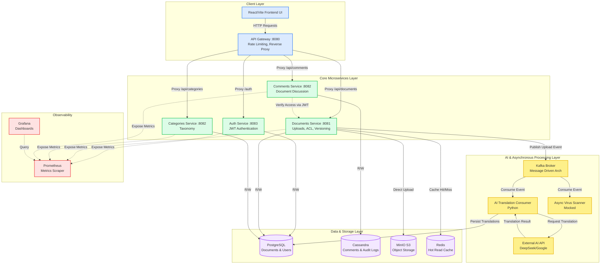

# Enterprise Document Management System - Architecture

This diagram illustrates the comprehensive microservices architecture of the Enterprise DMS, highlighting synchronous API flows, asynchronous message-driven processes, and data persistence layers.

## Key Architectural Patterns
1. **API Gateway Pattern:** All external client traffic enters through a single entry point (Port 8080).
2. **Microservices Architecture:** Independently deployable services with isolated domains (Auth, Documents, Comments).
3. **Database per Service:** Documents and Auth use PostgreSQL, while high-throughput Comments use Cassandra.
4. **Message-Driven Architecture:** The backend uses Kafka for event sourcing to decouple document uploads from AI translation.
5. **Cache-Aside Pattern:** Redis caches hot read paths (`@Cacheable`) and is invalidated on writes (`@CacheEvict`).
