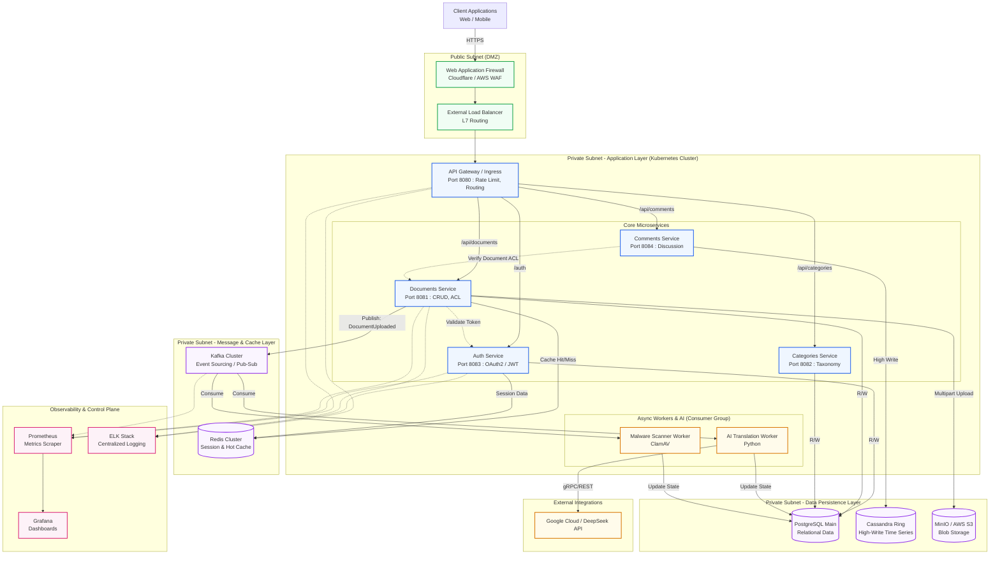

# Enterprise Document Management System (DMS) - Architecture Specification

## 1. Executive Summary

The Enterprise Document Management System (DMS) is a highly scalable, secure, and resilient microservices-based platform designed for large-scale institutional use. The architecture is built to support high-throughput document ingestion, stringent Access Control List (ACL) enforcement, and asynchronous AI-driven processing (such as automated translation and malicious payload scanning). 

The system prioritizes **High Availability (HA)**, **Fault Tolerance**, and **Data Integrity**, leveraging a polyglot persistence strategy and an event-driven backbone to ensure seamless performance under heavy organizational load.

---

## 2. System Architecture Topology

The following diagram illustrates the deployment and networking topology, showcasing traffic flow from the public internet through to the private persistence layers.

---

## 3. Core Components & Technologies

The platform embraces the **Microservices Architecture** pattern, ensuring independent deployability, scaling, and fault isolation.

*   **API Gateway (Spring Cloud Gateway / NGINX):** Acts as the single entry point. Responsible for SSL termination, routing, global CORS policy, rate limiting, and initial request sanitization.
*   **Auth Service (Spring Boot / Java):** Centralizes Identity and Access Management (IAM). Handles OAuth2/OpenID Connect (OIDC) flows, generating and validating stateless JWTs (JSON Web Tokens).
*   **Documents Service (Spring Boot / Java):** The core domain service managing document metadata, versioning histories, and ACL validation. Orchestrates the direct upload of binary files to Object Storage.
*   **Categories Service (Spring Boot / Java):** Manages organizational taxonomy, allowing dynamic hierarchical classification of documents.
*   **Comments Service (Node.js / Java):** Manages user discussions tied to documents. Designed for high throughput to prevent read/write locks on the main document service.

---

## 4. Data Architecture & Persistence Strategy

The system utilizes the **Database-per-Service** and **Polyglot Persistence** patterns to optimize for specific read/write workloads:

1.  **PostgreSQL (Relational):** Used by Auth, Documents, and Categories services. Guarantees ACID compliance for critical metadata, user relations, and financial/legal taxonomy structures.
2.  **Apache Cassandra (NoSQL / Wide-Column):** Used by the Comments Service and Audit Logging. Optimized for high-velocity, append-only time-series data where eventual consistency is acceptable.
3.  **MinIO / Amazon S3 (Object Storage):** Stores the physical, encrypted document blobs. Separates heavy binary data from relational databases to maintain database performance and reduce backup footprints.
4.  **Redis (In-Memory Cache):** Implements the **Cache-Aside Pattern**. Stores frequently accessed data (e.g., taxonomy trees, active sessions, hot documents) to drastically reduce database query load.

---

## 5. Asynchronous Processing & Event-Driven Architecture

To maintain low latency on the main thread, the system employs a **Message-Driven Architecture** using **Apache Kafka**.

*   **Event Choreography:** When a document is uploaded, the Documents Service synchronously returns a `202 Accepted` status and publishes a `DocumentUploadedEvent` to a Kafka topic.
*   **Decoupled Consumers:** 
    *   **AI Translation Worker:** Consumes the event, requests a translation from an external AI model (e.g., DeepSeek/Google), and asynchronously updates the database.
    *   **Security Worker:** Scans the binary payload for malware.
*   **Benefits:** This ensures that external API latency (AI translation) or CPU-intensive tasks (virus scanning) do not block the user interface or consume threads on the core API servers.

---

## 6. Security & Authentication

Security is implemented at multiple layers (Defense in Depth):
1.  **Edge Protection:** A Web Application Firewall (WAF) mitigates DDoS attacks and OWASP Top 10 vulnerabilities.
2.  **Transport Security:** Strict TLS 1.3 encryption across all public and internal (mTLS) network boundaries.
3.  **Authentication (OAuth2/OIDC):** Users authenticate via a centralized Identity Provider. The system uses short-lived JWTs and secure HttpOnly refresh tokens.
4.  **Authorization (RBAC & ACL):** Role-Based Access Control determines broad permissions (e.g., "Admin", "Viewer"), while strict Document-Level Access Control Lists (ACLs) verify if a specific user can access a specific file.

---

## 7. Resiliency & Deployment Topologies

The system is designed for high availability and automated disaster recovery:
*   **Container Orchestration:** Deployed on **Kubernetes** to ensure self-healing. If a Document Service pod crashes, the ReplicaSet automatically provisions a replacement.
*   **Auto-Scaling:** Horizontal Pod Autoscaler (HPA) dynamically scales services based on CPU/Memory utilization or Kafka lag metrics.
*   **Database Redundancy:** PostgreSQL is configured with synchronous replication (Primary/Standby). Cassandra operates in a ring topology across multiple Availability Zones (AZs) to survive node failures.
*   **Observability:** A full control plane utilizing Prometheus (Metrics), Grafana (Visualization), and ELK (Centralized Logging) ensures engineers have deep visibility into system health, enabling proactive incident response.

---

## 8. Functional Use Case Validation

To validate the architecture, the following functional scenario traces the data flow across the microservices, proving that the system supports complex multi-department Access Control (ACL) and asynchronous AI processing.

**Scenario: Multi-Department Document Management**

| Step | Action | Architectural Flow |
| :--- | :--- | :--- |
| **1** | **Admin creates departments:** Finance & IT | Request routed via **API Gateway** $\rightarrow$ **Auth Service** (IAM/Group Management). Departments are saved as Groups/Tenants in **PostgreSQL**. |
| **2** | **Admin creates users:** u1, u2, u3 | **Auth Service** provisions the user identities securely in **PostgreSQL**. |
| **3** | **Admin assigns users to departments:** u1(IT), u2(Finance), u3(Both) | **Auth Service** updates User-Group mappings (RBAC) in **PostgreSQL**. |
| **4** | **Admin creates categories:** General, Admin, Training | Routed via **API Gateway** $\rightarrow$ **Categories Service**. Taxonomy is saved in **PostgreSQL** and cached in **Redis**. |
| **5** | **User logs in:** via frontend | **Auth Service** authenticates credentials and returns a secure JWT containing the user's assigned Department IDs in the token payload. |
| **6** | **u1 uploads a PDF to IT:** | **API Gateway** $\rightarrow$ **Documents Service**. The service validates the JWT, saves metadata (ACL=IT) in **PostgreSQL**, and streams the physical PDF to **MinIO (S3)**. A `DocumentUploadedEvent` is published to **Kafka**. |
| **7** | **u1 comments on the document:** | **API Gateway** $\rightarrow$ **Comments Service**. The service verifies read access via the **Documents Service** (sync) and saves the discussion in **Cassandra**. |
| **8** | **u2 logs in & views documents:** | **Auth Service** provides JWT (Finance role). **Documents Service** queries **PostgreSQL** filtering strictly by ACL=Finance. u2 sees zero IT documents, ensuring data isolation. |
| **9** | **u2 uploads a PDF to Finance:** | **Documents Service** saves metadata (ACL=Finance) in **PostgreSQL** and the binary file to **MinIO**. Publishes an event to **Kafka**. |
| **10** | **u3 logs in, views & downloads:** | u3's JWT contains both IT & Finance roles. **Documents Service** permits access and returns metadata for both files. **MinIO** serves the binary streams upon request. |
| **11** | **u1 sees translated title:** | In the background (from Step 6), the **AI Translation Worker** consumed the Kafka event, called the External AI API, and updated the Document metadata in **PostgreSQL**. When u1 views the document, the **Documents Service** serves the newly translated title. |
