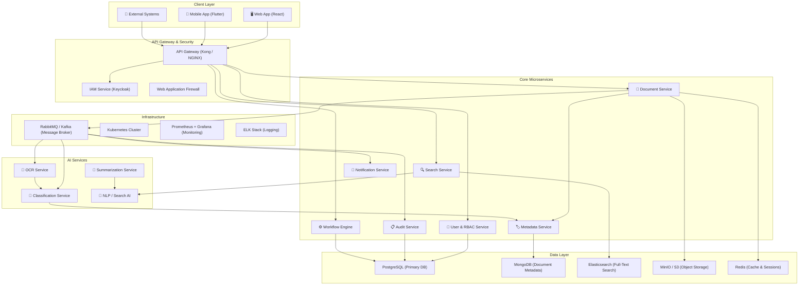
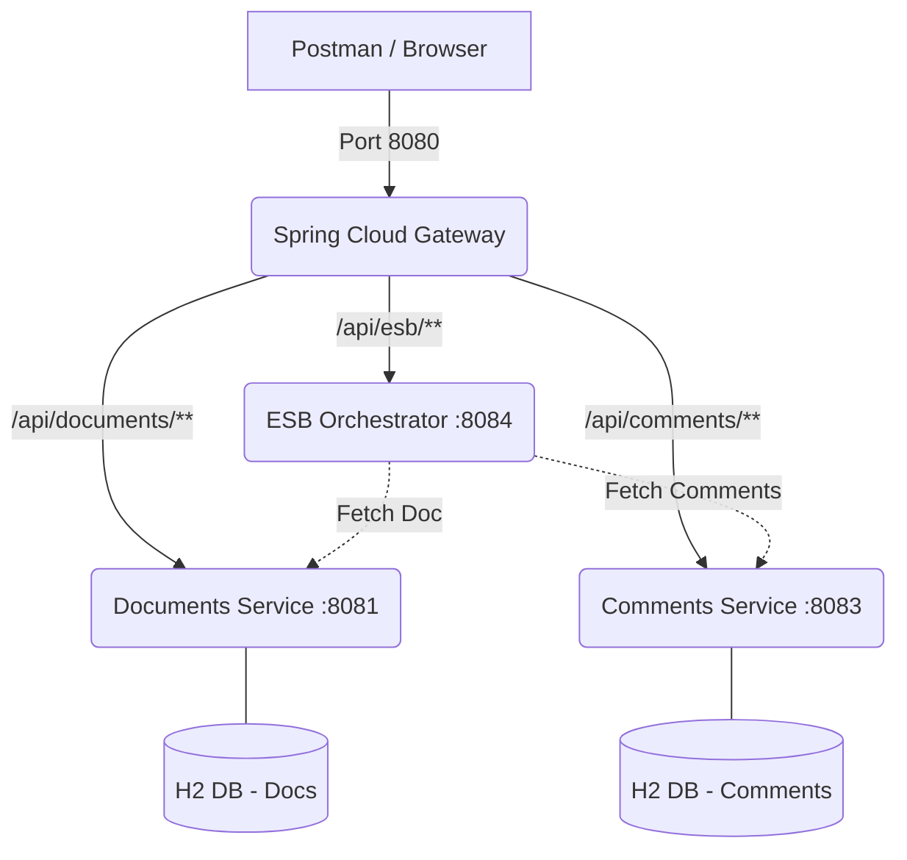
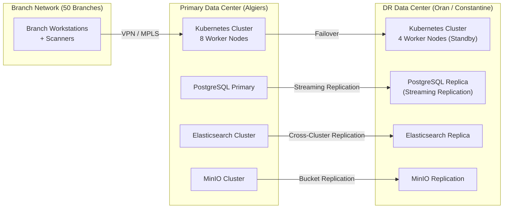

# Enterprise DMS Lab — Complete Answers

---

## Task C1 — Recap & Revision (SDLC & Enterprise Systems)

---

### 1. What are the main phases of the SDLC?

The **Software Development Life Cycle (SDLC)** consists of the following canonical phases:

| # | Phase | Key Activities |
|---|-------|---------------|
| 1 | **Planning & Feasibility** | Define project scope, cost-benefit analysis, resource estimation, risk assessment, schedule creation |
| 2 | **Requirements Analysis** | Elicit, document, and validate functional & non-functional requirements; produce SRS (Software Requirements Specification) |
| 3 | **System & Software Design** | Architectural design (high-level), detailed design (low-level), database schema, UI/UX wireframes, API contracts |
| 4 | **Implementation (Coding)** | Translate designs into source code following coding standards, conduct code reviews |
| 5 | **Testing & Quality Assurance** | Unit testing, integration testing, system testing, UAT (User Acceptance Testing), performance & security testing |
| 6 | **Deployment & Release** | Staging → Production rollout, data migration, user training, go-live support |
| 7 | **Maintenance & Evolution** | Bug fixes (corrective), enhancements (adaptive/perfective), monitoring, SLA management |

> [!NOTE]
> In enterprise contexts, many organizations overlay these phases with governance gates (e.g., Architecture Review Board sign-offs, Change Advisory Board approvals) that do not exist in smaller projects.

---

### 2. What distinguishes an "enterprise system" from a regular application?

| Dimension | Regular Application | Enterprise System |
|-----------|-------------------|-------------------|
| **User Scale** | Tens to hundreds of users | Thousands to tens of thousands of concurrent users |
| **Organizational Scope** | Single team / department | Cross-departmental, multi-branch, sometimes multi-country |
| **Integration** | Standalone or few integrations | Deep integration with ERP, CRM, HRMS, Core Banking, email, AD/LDAP, etc. |
| **Data Volume & Sensitivity** | Moderate data, basic security | Massive data volumes, strict confidentiality (PII, financial records), regulatory compliance |
| **Availability & SLA** | Best-effort uptime | 99.9%+ uptime, disaster recovery, business continuity plans |
| **Governance** | Minimal formal governance | Formal change management, audit trails, role-based access, separation of duties |
| **Lifecycle** | Months to a few years | 10–20+ years of expected operational life |
| **Customization** | Generic features | Highly configurable per department, region, and regulatory jurisdiction |
| **Security** | Basic authentication | Multi-factor authentication, encryption at rest & in transit, intrusion detection, SOC compliance |
| **Compliance** | Minimal | Must comply with industry regulations (e.g., banking secrecy laws, Banque d'Algérie regulations, GDPR-equivalent) |

**In summary:** An enterprise system is mission-critical, cross-functional, heavily regulated, and must be designed for longevity, scale, and auditability from day one.

---

### 3. How does the enterprise context change requirements gathering compared to small-scale software?

| Aspect | Small-Scale | Enterprise Context |
|--------|------------|-------------------|
| **Stakeholders** | 1–3 stakeholders (often the same person is user + sponsor) | Dozens of stakeholders across departments, branches, and management layers — each with competing priorities |
| **Elicitation Techniques** | Informal interviews, user stories | Formal workshops, JAD sessions, process mapping (BPMN), regulatory review, RFP/RFI documents |
| **Requirements Artifacts** | Lightweight user stories or a brief spec | SRS, Business Requirements Document (BRD), Functional Specification, Non-Functional Requirements matrix, Traceability Matrix |
| **Conflict Resolution** | Resolved in a quick meeting | Requires formal prioritization frameworks (MoSCoW, Kano), steering committee arbitration |
| **Non-Functional Requirements** | Often implicit | Explicitly specified: performance benchmarks, security certifications, compliance mandates, scalability targets, DR/BCP requirements |
| **Change Management** | Agile, informal | Formal Change Control Board (CCB); every requirement change is impact-assessed, versioned, and approved |
| **Regulatory Constraints** | Rare | Requirements are often **dictated** by external regulators (central bank regulations, data protection laws) — non-negotiable |
| **Localization / i18n** | Usually single-language | Must support Arabic, French, and potentially English for an Algerian bank |
| **Cross-System Dependencies** | None or few | Requirements must account for interactions with existing legacy systems (core banking, Active Directory, email servers) |

**Key Insight:** In enterprise requirements gathering, the biggest challenge is not *finding* requirements — it is **managing the volume, conflicts, and traceability** of requirements across a large, politically complex organization.

---

### 4. Why is maintenance/evolution particularly critical for enterprise systems?

1. **Long Operational Lifespan (10–20+ years):** Enterprise systems outlive the team that built them. Maintenance cost typically represents **60–80%** of the total cost of ownership (TCO).

2. **Regulatory Evolution:** Banking regulations change frequently. The DMS must evolve to comply with new Banque d'Algérie circulars, anti-money laundering (AML) rules, and data protection laws — failure means legal penalties.

3. **Organizational Change:** Mergers, new branches, departmental restructuring, and new products all require system adaptation.

4. **Technology Obsolescence:** Over a 15-year lifespan, underlying frameworks, operating systems, and databases will be deprecated. The system must be architecturally designed for technology migration.

5. **Integration Drift:** Connected systems (core banking, HRMS, ERP) are independently upgraded, breaking interfaces. Continuous integration maintenance is required.

6. **Security Threats:** The threat landscape evolves daily. Regular patching, vulnerability assessments, and security updates are non-negotiable for a financial institution.

7. **Data Growth:** Document volumes grow exponentially. Storage, indexing, and search performance must be continuously optimized.

8. **Knowledge Loss:** Staff turnover means the team maintaining the system in Year 10 has no overlap with the original builders. Comprehensive documentation and clean architecture are survival requirements.

> [!IMPORTANT]
> An enterprise system that is not designed for maintainability from the start becomes a **legacy liability** within 3–5 years — a system that is too expensive to replace and too fragile to change.

---
---

## Task C2 — DMS Requirements Engineering & Enterprise Attributes

---

### Part 1: Existing DMS Solutions & Pricing

| Solution | Type | Strengths | Pricing Model | Estimated Cost (1000 users) |
|----------|------|-----------|---------------|---------------------------|
| **Microsoft SharePoint Online** | Cloud (SaaS) | Deep Microsoft 365 integration, familiar UI, strong collaboration | $5–$23/user/month (M365 plans) | **$60K–$276K/year** |
| **OpenText Documentum** | On-Prem / Hybrid | Enterprise-grade, massive scalability, strong compliance, used by top banks globally | Custom enterprise licensing | **$500K–$2M+ upfront** + 20% annual maintenance |
| **M-Files** | Cloud / On-Prem / Hybrid | Metadata-driven (no folder structure), AI classification, strong compliance | $39–$99/user/month | **$468K–$1.2M/year** |
| **DocuWare** | Cloud / On-Prem | Excellent workflow automation, strong in finance/HR processes | $40–$80/user/month | **$480K–$960K/year** |
| **Laserfiche** | Cloud / On-Prem | AI-powered capture, process automation, strong compliance, popular in government/banking | Custom pricing | **$300K–$800K/year** (estimated) |
| **Alfresco (Hyland)** | Open-Source / Enterprise | Open-source core, highly customizable, Java-based, good for regulated industries | Community (free) / Enterprise ($$$) | **$200K–$600K/year** (Enterprise) |
| **Nuxeo (Hyland)** | Cloud-Native | Modern cloud-native architecture, headless CMS, strong API, AI-ready | Custom pricing | **$300K–$700K/year** |
| **LogicalDOC** | Open-Source / Enterprise | Lightweight, easy deployment, multi-language (Arabic support) | Community (free) / Enterprise | **$50K–$150K/year** (Enterprise) |

> [!TIP]
> **For an Algerian bank**, the most cost-effective approach is likely to **build a custom DMS** or use an **open-source base (Alfresco / LogicalDOC)** and customize it — avoiding the massive licensing costs of proprietary solutions while meeting specific regulatory requirements of the Algerian banking sector.

---

### Part 2: Functional Requirements per Department

#### 🏦 Investment Department
| # | Functional Requirement |
|---|----------------------|
| FR-INV-01 | Upload, version, and store client portfolio documents with metadata tagging |
| FR-INV-02 | Manage investment contract lifecycle (draft → review → approval → signed → archived) |
| FR-INV-03 | Store and index market research reports with full-text search |
| FR-INV-04 | Set document access by portfolio sensitivity level (confidential, restricted, internal) |
| FR-INV-05 | Generate portfolio document summaries and reports on demand |
| FR-INV-06 | Automated expiry alerts for investment contracts |

#### 👥 Human Resources
| # | Functional Requirement |
|---|----------------------|
| FR-HR-01 | Maintain a digital employee file (contracts, ID copies, diplomas, evaluations) |
| FR-HR-02 | Automate onboarding document workflow (offer letter → signed contract → file creation) |
| FR-HR-03 | Manage payroll document archives with monthly batch import |
| FR-HR-04 | Track recruitment pipeline documents (CVs, interview notes, offers) |
| FR-HR-05 | Enforce document retention policies (e.g., keep employee records 10 years post-departure) |
| FR-HR-06 | Self-service portal for employees to view their own documents |

#### 💻 IT Department
| # | Functional Requirement |
|---|----------------------|
| FR-IT-01 | Version-controlled storage of system/network documentation |
| FR-IT-02 | Vendor contract management with renewal alerts |
| FR-IT-03 | Security policy document lifecycle management with mandatory review cycles |
| FR-IT-04 | Change management documentation linked to ITSM tickets |
| FR-IT-05 | Disaster recovery plan documentation with periodic review enforcement |

#### 🏢 Operations
| # | Functional Requirement |
|---|----------------------|
| FR-OPS-01 | Digitize and index daily transaction records (scan + OCR) |
| FR-OPS-02 | Account opening document workflow (capture → verification → approval → storage) |
| FR-OPS-03 | Loan application document management with multi-level approval workflow |
| FR-OPS-04 | Cross-branch document sharing with branch-level access controls |
| FR-OPS-05 | Bulk document import/export for end-of-day processing |
| FR-OPS-06 | Integration with Core Banking System (CBS) for document-account linking |

#### ⚖️ Legal & Compliance
| # | Functional Requirement |
|---|----------------------|
| FR-LEG-01 | Regulatory filing tracker with submission deadline alerts |
| FR-LEG-02 | Audit trail for every document action (view, edit, download, delete, share) |
| FR-LEG-03 | Legal hold capability — prevent deletion/modification of documents under investigation |
| FR-LEG-04 | Compliance report generation (who accessed what, when, from where) |
| FR-LEG-05 | Automated classification of documents by regulatory category |
| FR-LEG-06 | Digital signature integration for legal contracts |

#### 📞 Customer Service
| # | Functional Requirement |
|---|----------------------|
| FR-CS-01 | Link customer correspondence to customer account (CRM integration) |
| FR-CS-02 | Complaint document tracking with SLA timers |
| FR-CS-03 | Service agreement templates with auto-fill from customer data |
| FR-CS-04 | Customer-facing document portal (view statements, agreements) |
| FR-CS-05 | Multi-channel document capture (email, fax, scan, web upload) |

#### 🛒 Procurement
| # | Functional Requirement |
|---|----------------------|
| FR-PROC-01 | Purchase request → Purchase order → Invoice → Payment document workflow |
| FR-PROC-02 | Vendor document management (contracts, certifications, insurance) |
| FR-PROC-03 | Three-way matching (PO ↔ Delivery Note ↔ Invoice) with document linking |
| FR-PROC-04 | Budget approval workflow with document attachments |
| FR-PROC-05 | Supplier performance documentation and evaluation records |

---

### Part 3: Enterprise Attributes (Non-Functional Requirements)

| Enterprise Attribute | Requirement for the Bank DMS |
|---------------------|------------------------------|
| **Scalability** | Must support 1,000 concurrent users across 50 branches; horizontal scaling to handle document growth (est. 500K+ documents/year) |
| **High Availability** | 99.9% uptime SLA; active-passive or active-active clustering; no single point of failure |
| **Disaster Recovery** | RPO < 1 hour, RTO < 4 hours; geo-redundant backups; automated failover |
| **Security** | End-to-end encryption (TLS 1.3 in transit, AES-256 at rest); MFA; RBAC with separation of duties; DLP (Data Loss Prevention) |
| **Audit & Compliance** | Immutable audit logs; tamper-proof document storage; compliance with Banque d'Algérie regulations, Algerian data protection law (Loi 18-07) |
| **Performance** | Document upload < 3 sec; search results < 2 sec for 10M+ document repository; page load < 1.5 sec |
| **Interoperability** | REST/SOAP APIs for integration with Core Banking, ERP (SAP/Oracle), HRMS, Active Directory/LDAP, email (Exchange/SMTP) |
| **Multi-tenancy** | Logical separation by branch/department; centralized administration with delegated branch-level admin |
| **Localization (i18n/L10n)** | Full RTL support for Arabic; French as primary business language; English for technical documentation |
| **Usability / Accessibility** | Responsive design (desktop + tablet for branch staff); WCAG 2.1 AA compliance; minimal training curve |
| **Data Sovereignty** | All data must be stored on servers physically located in Algeria (regulatory requirement) |
| **Backup & Archival** | Tiered storage: hot (SSD) for active docs, warm (HDD) for recent archives, cold (tape/object storage) for long-term; automated lifecycle policies |
| **Maintainability** | Modular architecture; comprehensive API documentation; CI/CD pipelines; < 2 hour deployment with zero downtime |
| **Extensibility** | Plugin/module architecture allowing new document types, workflows, and integrations without core changes |

---

### Part 4: AI Integration Features

| AI Feature | Description | Technology | Department Impact |
|-----------|-------------|------------|-------------------|
| **Intelligent Document Classification** | Auto-classify uploaded documents by type (contract, invoice, ID, report, correspondence) and route to correct department/folder | CNN + NLP (BERT/CamemBERT for French, AraBERT for Arabic) | All departments |
| **OCR + Intelligent Data Extraction** | Extract structured data from scanned documents (names, dates, amounts, account numbers) and auto-populate metadata | Tesseract OCR + custom ML extraction models | Operations, Procurement, HR |
| **Semantic Search** | Search documents by meaning rather than keywords — e.g., "find all contracts expiring next quarter" | Vector embeddings (Sentence-BERT) + Elasticsearch vector search | All departments |
| **Automated Document Summarization** | Generate executive summaries of lengthy reports, contracts, and regulatory filings | LLM (fine-tuned Mistral/LLaMA or GPT-4 API) | Investment, Legal, Management |
| **Anomaly Detection in Compliance** | Flag documents with missing signatures, expired dates, or non-standard clauses | Rule engine + ML anomaly detection | Legal & Compliance |
| **Intelligent Redaction** | Auto-detect and redact PII (national ID numbers, account numbers, phone numbers) before sharing | NER (Named Entity Recognition) + regex patterns | Legal, Customer Service |
| **Chatbot / Conversational Search** | Natural language Q&A over the document repository — "Show me the latest audit report for Branch 12" | RAG (Retrieval-Augmented Generation) with LLM | All departments |
| **Duplicate Detection** | Identify duplicate or near-duplicate documents to reduce storage waste and confusion | MinHash / SimHash + cosine similarity | All departments |
| **Workflow Recommendation** | Suggest next approval step or reviewer based on document type and historical patterns | Collaborative filtering + process mining | Operations, Procurement |
| **Predictive Retention** | Predict which documents are nearing regulatory retention expiry and auto-flag for review or destruction | Time-series analysis + rule engine | Legal & Compliance, HR |

> [!IMPORTANT]
> For an Algerian bank, AI models must support **Arabic (Algerian dialect + MSA) and French** — this is a critical constraint that eliminates many off-the-shelf English-only AI solutions.

---
---

## Task C3 — Software Architecture & Technology Stack

---

### High-Level Architecture: Microservices + Event-Driven



---

### Architecture Pattern Justification

| Pattern | Why |
|---------|-----|
| **Microservices** | Independent scaling per service; the Document Service handles heavy I/O while the Workflow Engine handles CPU-intensive logic. Independent deployment allows zero-downtime updates. |
| **Event-Driven (CQRS)** | Document upload triggers asynchronous events: OCR → Classification → Metadata Enrichment → Indexing → Notification. This decouples services and prevents upload latency from blocking the user. |
| **API Gateway** | Single entry point for all clients; handles authentication, rate limiting, SSL termination, request routing, and API versioning. |
---

## Task / Exercise C1 (Introductory Service + SPOF)

### 3. Imagine that this node is the only authority of data, and suddenly crashed
**a. What would happen to other services relying on this node? Facebook 2021?**
Other services relying on this node would experience complete timeouts, HTTP 5xx errors, and cascading failures depending on their resilience. 
In the Facebook 2021 global outage, an erroneous BGP configuration caused their authoritative DNS servers to become unreachable. Because DNS acted as a Single Point of Failure (SPOF) for internal and external routing, all dependent systems (Facebook, Instagram, WhatsApp, and even internal corporate tools/badge readers) were forced completely offline.

**b. Why the need to avoid SPOF?**
A SPOF prevents a system from achieving High Availability (HA) and fault tolerance. In an enterprise system, losing the single node guarantees a direct business outage, resulting in financial loss, damaged reputation, and breached SLAs.

**c. Write down the techniques of how to mitigate SPOF:**
*   **Redundancy & Replication:** Deploying multiple instances (Active-Active or Active-Passive) of compute nodes and synchronizing data across distributed databases.
*   **Load Balancing:** Distributing traffic across a cluster of healthy nodes (e.g., using a reverse proxy or AWS ALB).
*   **Failover Mechanisms:** Automatically shifting traffic and switching the primary leader role if the designated active node fails.
*   **Circuit Breakers & Graceful Degradation:** Preventing a single microservice failure from infinitely blocking upstream services.
*   **Distributed Consensus:** Utilizing masterless databases (peer-to-peer) or quorum-based voting (like Raft or Paxos) so no single node is uniquely critical.

---

## Task / Exercise C2 (Service Availability vs. Consistency + CAP in Action)

### Part 1 : Redundancy Without Coordination.
**3. The system is available. Why is it unsafe?**
The system is highly available (you can write to Node A and read from Node B), but it suffers from severe **Stale Reads** and **Data Inconsistency**. Because there is no coordination or replication taking place, data written to Node A does not exist in Node B's in-memory store. 

### Part 2 : Availability vs. Consistency
**3. Discuss whether the consistency (CP) or availability (AP) is prioritized here when replicating the data or the code is not well structured?**
When `REQUIRE_REPLICATION = True`, if Node B is unreachable, Node A immediately fails the write and returns a `503 Service Unavailable`. This means the system refuses a write unless it can be strongly synchronized—prioritizing **Consistency (CP) over Availability**. 
However, the code is very poorly structured for enterprise standards: the replication uses a blocking, synchronous HTTP call within the critical request path. It lacks retries, timeout fallbacks, or proper quorum-based commit logic. Given a minor network glitch, the entire node effectively halts writes.

### Part 3 : CAP in Action
**Improve the code via using the MODE FLAG:**

To handle both cases (`"CP"` vs `"AP"`):

```python
if REQUIRE_REPLICATION:
    try:
        requests.get(f"{PEER}/documents/replicate", params=document, timeout=1)
    except:
        if MODE == "CP":
            # Strict consistency: Fail the write if replication fails
            del documents[doc_id] 
            return jsonify({"error": "Write rejected, replication failed"}), 503
        elif MODE == "AP":
            # Availability: Accept the write, warn/queue for asynchronous replication
            return jsonify({
                "status": "document added locally, replication deferred", 
                "document": document
            })
```

*   **a. DMS for a Banking App (CP):** Financial transactions demand strict consistency. If a compliance document isn't safely replicated, the write must fail immediately to preserve data integrity and prevent legal violations.
*   **b. Chat/Messaging (AP):** A messaging service values low latency and high availability. It is acceptable for local nodes to process the message and sync it eventually.

---

## Task / Exercise C3 (Exploring Enterprise Technologies)

Identify whether the following behave mostly as CP or AP:
*   **etcd:** **CP** (Consistency). Relies on the Raft consensus algorithm and guarantees strong consistency. Used as Kubernetes' primary datastore.
*   **Apache Cassandra:** **AP** (Availability). Features a masterless ring architecture designed for exceptionally high availability and partition tolerance. It offers tunable consistency but naturally defaults to eventual consistency.
*   **CouchDB:** **AP** (Availability). Uses a peer-to-peer distributed replication model with multi-master setups, tailored towards offline-first and eventually consistent scenarios.
*   **Apache Kafka:** Generally **CP**. While often used for highly available messaging, it designates a single leader for each topic partition. If configured properly (e.g., `acks=all`), it provides strict consistency across replicas.

---

## ASSIGNMENT A1 (Java Spring Boot Migration)

**Migrated Code using Java Spring Boot:**

```java
import org.springframework.boot.SpringApplication;
import org.springframework.boot.autoconfigure.SpringBootApplication;
import org.springframework.http.HttpStatus;
import org.springframework.http.ResponseEntity;
import org.springframework.web.bind.annotation.*;
import org.springframework.web.client.RestTemplate;

import java.time.Instant;
import java.util.*;
import java.util.concurrent.ConcurrentHashMap;

@SpringBootApplication
@RestController
@RequestMapping("/documents")
public class DmsApplication {

    private final Map<String, Map<String, Object>> documents = new ConcurrentHashMap<>();
    private final String PEER = "http://localhost:5001";
    private final boolean REQUIRE_REPLICATION = false;
    private final String MODE = "AP"; // "AP" or "CP"
    private final RestTemplate restTemplate = new RestTemplate();

    public static void main(String[] args) {
        SpringApplication.run(DmsApplication.class, args);
    }

    @GetMapping("/add")
    public ResponseEntity<?> addDocument(@RequestParam String title, @RequestParam String content) {
        if (title == null || content == null) {
            return ResponseEntity.badRequest().body(Map.of("error", "title and content required"));
        }

        String docId = UUID.randomUUID().toString();
        Map<String, Object> document = new HashMap<>();
        document.put("id", docId);
        document.put("title", title);
        document.put("content", content);
        document.put("created_at", Instant.now().toString());

        documents.put(docId, document);

        if (REQUIRE_REPLICATION) {
            try {
                String url = String.format("%s/documents/replicate?id=%s&title=%s&content=%s&created_at=%s",
                        PEER, docId, title, content, document.get("created_at"));
                restTemplate.getForObject(url, String.class);
            } catch (Exception e) {
                if ("CP".equals(MODE)) {
                    documents.remove(docId);
                    return ResponseEntity.status(HttpStatus.SERVICE_UNAVAILABLE)
                            .body(Map.of("error", "Write rejected, replication failed"));
                }
                // Under AP mode, the node continues gracefully returning 200 OK.
            }
        }

        return ResponseEntity.ok(Map.of("status", "document added", "document", document));
    }

    @GetMapping("/replicate")
    public ResponseEntity<?> replicateDocument(@RequestParam String id, @RequestParam String title,
                                               @RequestParam String content, @RequestParam String created_at) {
        if (id == null) {
            return ResponseEntity.badRequest().body(Map.of("error", "invalid replication data"));
        }

        Map<String, Object> document = new HashMap<>();
        document.put("id", id);
        document.put("title", title);
        document.put("content", content);
        document.put("created_at", created_at);

        documents.put(id, document);
        return ResponseEntity.ok(Map.of("status", "replicated"));
    }

    @GetMapping("/list")
    public ResponseEntity<?> listDocuments() {
        return ResponseEntity.ok(documents.values());
    }
}
```

---

## OPTIONAL EXERCISES

### Task / Exercise P1

Without full implementation, to solve the limitations of the Python service:
*   **Replicate data to a large number of nodes:** Instead of tightly-coupled, point-to-point HTTP GET requests via an array, introduce an **Asynchronous Message Broker** (like Kafka, RabbitMQ, or AWS SNS). The primary node acts as a publisher submitting a `DocumentCreated` event. Replicas act as distributed consumers applying the change at their own pace without blocking the source API.
*   **Integrate a load balancer to avoid SPOF:** Situate a centralized **API Gateway / Load Balancer** (like NGINX, HAProxy, AWS ALB, or Spring Cloud Gateway) in front of the system. The client sends a single request to the balancer, which proxies it to healthy backend nodes using round-robin logic or health checks.

### Task / Exercise P2

**Integrating the Strategy Design Pattern for Ex2 - Part 3:**
To improve the monolithic internal logic where the replication acts directly against `MODE` conditions:

1.  **Define Strategy Interface:** Create an interface `IReplicationStrategy` providing a contract for handling persistence, for example `executeReplicationFallback(...)`.
2.  **Concrete Implementations:** 
    *   Create a `StrictConsistencyStrategy` (for CP): Inside its fallback handler, it forcibly rolls back the local memory store write and throws a `ReplicationFailedException` handled by a top-level controller advice converting it into a 503 response.
    *   Create a `HighAvailabilityStrategy` (for AP): Inside its fallback handler, it catches the network drop, logs the error, and queues the change to a dead-letter/retry queue locally, completely hiding the replication failure from the end user.
3.  **Inject the Strategy:** Pass the active strategy into the document service layer at setup based on the configuration logic, thus thoroughly decoupling protocol routing logic from application state handling.

---

# LAB 2 — REST/SOAP Web Services, Gateway & Orchestration (ESB)

---

## Task / Exercise C1 (Creating REST Web Services)

### Part 1: Service D (Documents) on Port 8081
Here is the minimal Spring Boot implementation for the Document service using Spring Data JPA and H2:

```java
// Document.java
@Entity
public class Document {
    @Id @GeneratedValue(strategy = GenerationType.IDENTITY)
    private Long id;
    private String title;
    // Getters and Setters...
}

// DocumentRepository.java
@Repository
public interface DocumentRepository extends JpaRepository<Document, Long> {}

// DocumentController.java
@RestController
@RequestMapping("/documents")
public class DocumentController {
    private final DocumentRepository repository;

    public DocumentController(DocumentRepository repository) {
        this.repository = repository;
    }

    @GetMapping("/list")
    public List<Document> listDocuments() {
        return repository.findAll();
    }

    @GetMapping("/get/{id}")
    public ResponseEntity<Document> getDocument(@PathVariable Long id) {
        return repository.findById(id)
                .map(ResponseEntity::ok)
                .orElse(ResponseEntity.notFound().build());
    }

    @PostMapping("/add")
    public Document addDocument(@RequestParam String title) {
        Document doc = new Document();
        doc.setTitle(title);
        return repository.save(doc);
    }
}
```
*(Tested via Postman: `POST http://localhost:8081/documents/add?title=Invoice`)*

### Part 2: Service M (Comments) on Port 8083

```java
// Comment.java
@Entity
public class Comment {
    @Id @GeneratedValue(strategy = GenerationType.IDENTITY)
    private Long id;
    private Long docId;
    private String content;
    // Getters and Setters...
}

// CommentRepository.java
@Repository
public interface CommentRepository extends JpaRepository<Comment, Long> {
    List<Comment> findByDocId(Long docId);
}

// CommentController.java
@RestController
@RequestMapping("/comments")
public class CommentController {
    private final CommentRepository repository;

    public CommentController(CommentRepository repository) {
        this.repository = repository;
    }

    @GetMapping("/list/{docId}")
    public List<Comment> getComments(@PathVariable Long docId) {
        return repository.findByDocId(docId);
    }

    @PostMapping("/add")
    public Comment addComment(@RequestParam Long docId, @RequestParam String content) {
        Comment comment = new Comment();
        comment.setDocId(docId);
        comment.setContent(content);
        return repository.save(comment);
    }
}
```

**Discussion: Merging Comments inside Documents?**
*   **Scalability**: Harmed. If comments are read/written 100x more frequently than documents, merging them forces you to scale the heavier Document service just to support comment traffic. Keeping them separate allows independent scaling.
*   **Cohesion**: Improved if considered a single bounded context (an Aggregate in DDD). However, if comments evolve to support generic threading across the whole system, separation is better.
*   **Coupling**: Decreased organizationally if separated (teams can work independently), but it introduces distributed network coupling (you must fetch comments over the network instead of a simple SQL `JOIN`).

---

## Task / Exercise C2 (Gateway)

### Discuss how to access the services via gateway
With the provided `application.yml` running on port 8080:
*   To reach the Documents service: `GET http://localhost:8080/api/documents/list`
*   To reach the Comments service: `GET http://localhost:8080/api/comments/list/1`

The `RewritePath` filter strips `/api/documents` and routes the request transparently to `http://localhost:8081/documents`.

### What problem does Gateway solve?
1.  **Reverse Routing / Encapsulation:** Clients interact with one entry-point (`8080`) instead of tracking IPs and ports for dozens of microservices.
2.  **Cross-Cutting Concerns:** Centralizes Authentication, SSL termination, CORS, Rate Limiting, and Access Logging so individual services don't have to duplicate this logic.

### Can the Gateway become a Single Point of Failure (SPOF)? How to mitigate?
**Yes.** If the Gateway crashes, no external traffic can reach any backend service, causing a complete system outage.
**Mitigation:** 
Deploy multiple instances of the Gateway service behind a highly available Load Balancer (e.g., NGINX, HAProxy, AWS ALB) or use DNS round-robin routing to distribute traffic among the healthy Gateway instances.

---

## Task / Exercise C3 (ESB / Orchestration)

### 1. Implementation using Spring Integration (Port 8084)

```java
@Configuration
public class IntegrationConfig {

    @Bean
    public IntegrationFlow documentAggregationFlow(RestTemplate restTemplate) {
        return IntegrationFlow.from("documentRequestChannel")
            .handle((payload, headers) -> {
                Long id = (Long) payload;
                try {
                    Object doc = restTemplate.getForObject("http://localhost:8081/documents/get/" + id, Object.class);
                    Object comments = new ArrayList<>();
                    // 2. Prioritize Availability of Document
                    try {
                        comments = restTemplate.getForObject("http://localhost:8083/comments/list/" + id, Object.class);
                    } catch (Exception e) {
                        // Log comment service failure, fallback to empty array
                    }
                    return Map.of("document", doc, "comments", comments);
                } catch (Exception e) {
                    throw new RuntimeException("Document service unavailable");
                }
            })
            .get();
    }
}
```

### 2. What happens if the comments service goes down?
By wrapping the Comments service call in a `try/catch` block (as shown above), we **prioritize Availability**. If `M` crashes, the ESB still returns the core document data with an empty (or fallback) comments list, ensuring the primary business function (viewing documents) remains available.

### 3. Architecture for this minimal version



---

## OPTIONAL EXERCISES

**P1**
*   **Universal Unique ID:** Instead of database sequences (`Long`), use `UUID.randomUUID().toString()`. This prevents ID enumeration attacks and allows distributed ID generation without database locks.
*   **Hide thoroughly:** Bind services D and M to `localhost` or put them in an isolated Docker network where only the Gateway and ESB have access.
*   **Why centralized ESB?** It removes complex integration logic (scatter-gather, retries, aggregation) from the lightweight microservices, allowing them to remain purely focused on their own domain boundaries.

**P2 (SOAP/SOA)**
Running on port 8082, the provided `@Endpoint` relies on `spring-boot-starter-web-services`. SOAP uses an XML envelope. To test via Postman, you must send an `HTTP POST` request containing a valid XML SOAP Envelope with the `GetCategoriesRequest` payload to the configured URI (usually `/ws`).

**P3**
*   **Actuator:** Provides production-ready endpoints (`/actuator/health`, `/actuator/metrics`) to monitor service uptime, memory usage, and database health.
*   **Gateway Filters:** Can modify headers, add authorization tokens, implement Spring Cloud Circuit Breaker, or enforce Redis Rate Limiting before routing traffic.

**P4 (Consistency Strategy if Document is Deleted)**
*   **Event-Driven (SAGA/Choreography):** When `D` deletes a document, it publishes a `DocumentDeletedEvent(docId)` to a message broker (RabbitMQ/Kafka). Service `M` listens to this topic and asynchronously cascades the deletion for associated comments. This ensures eventual consistency without blocking `D`.

**P5 (External Storage)**
*   Supabase (acting as Postgres) can be used via standard JDBC/JPA properties in `application.yml` for Service D.
*   Comments (Service M) can utilize `spring-boot-starter-data-mongodb` completely decoupling the database technologies (Polyglot Persistence).

**P6 (Why simple RestTemplate is NOT recommended)**
The basic `@RestController` approach creates a **Sequential Blocking Pipeline**. 
If D takes 2 seconds and M takes 2 seconds, the user waits 4 seconds. Furthermore, there is no native backpressure, circuit breaking, or timeout management. **Spring Integration** or reactive approaches (like `WebClient` or `CompletableFuture`) allow parallel execution (Scatter-Gather) and robust failure handling.

---

# SUMMARY OF WORK UNTIL NOW

### Lab 1: Fundamentals of Enterprise Systems
*   **Theory:** Explored differences between simple applications and Enterprise Systems (SLA, compliance, scale). Identified the SDLC phases and adjusted requirements capturing for large organizations.
*   **Architectural Foundations:** Discussed Single Point of Failure (SPOF) using the Facebook 2021 outage. Migrated a Python Flask application resolving SPOF issues by discussing clustering, Load Balancing, and Message Brokers.
*   **CAP Theorem:** Demonstrated the trade-offs between Availability (AP) and Consistency (CP) in distributed data replication.
*   **Assignment A1:** Successfully migrated the Python `Documents` code into a robust Java Spring Boot application.

### Lab 2: Microservices & Orchestration
*   **Services Separation (SOA):** Broke a monolithic concept into disparate services — Documents (D) and Comments (M), giving them their own databases (H2) and lifecycles.
*   **API Gateway:** Created a Spring Cloud Gateway (G) to encapsulate the internal network, unify the entry API, and handle cross-cutting concerns, while identifying its SPOF risks.
*   **Orchestration (ESB):** Engineered an aggregation service (E) using Spring Integration to combine D and M payloads effectively, emphasizing functional fallbacks (Availability vs Consistency) when internal services crash.
*   **Advanced Topologies:** Addressed CQRS, Event-Driven deletes, UUIDs, Polyglot persistence (Supabase + NoSQL), and SOAP integration concepts to prepare for the upcoming Backend Increments.

---

### Complete Technology Stack

#### Backend

| Layer | Technology | Justification |
|-------|-----------|---------------|
| **Language** | **Java 21 (Spring Boot 3.x)** | Industry standard for enterprise/banking; mature ecosystem, strong typing, excellent for microservices; large talent pool |
| **Alternative** | **C# (.NET 8)** or **Go** for high-performance services | Go for OCR/AI proxy services where low latency matters |
| **API Framework** | Spring Boot + Spring Cloud | Service discovery (Eureka), config management, circuit breakers (Resilience4j), API gateway integration |
| **Workflow Engine** | **Camunda 8** (BPMN 2.0) | Visual workflow designer; bank staff can model approval flows without code; audit-ready execution logs |
| **Message Broker** | **Apache Kafka** | High-throughput event streaming; event sourcing for audit; replay capability for disaster recovery |
| **Authentication** | **Keycloak** (OpenID Connect / OAuth 2.0) | Open-source IAM; LDAP/AD federation; MFA support; SSO across all services; fine-grained authorization |
| **API Gateway** | **Kong** or **Spring Cloud Gateway** | Rate limiting, SSL termination, API versioning, request/response transformation |

#### Frontend

| Layer | Technology | Justification |
|-------|-----------|---------------|
| **Web Framework** | **React 18+ with TypeScript** | Component-based; massive ecosystem; excellent for complex enterprise UIs; strong typing with TS |
| **State Management** | **Redux Toolkit + RTK Query** | Predictable state; built-in caching and API integration |
| **UI Library** | **Ant Design** or **MUI (Material UI)** | Enterprise-grade components (tables, forms, trees); RTL support for Arabic; accessibility built-in |
| **Document Viewer** | **PDF.js + custom viewer** | In-browser document preview without download (security requirement) |
| **Mobile** | **Flutter** (for field agents / branch tablets) | Cross-platform; single codebase for iOS + Android; good offline support |

#### Data Layer

| Layer | Technology | Justification |
|-------|-----------|---------------|
| **Relational DB** | **PostgreSQL 16** | ACID compliance (critical for banking); JSONB for flexible metadata; row-level security; enterprise-proven |
| **Document Metadata** | **MongoDB** | Flexible schema for diverse document types; each department has different metadata fields |
| **Full-Text Search** | **Elasticsearch 8** | Blazing-fast full-text search; Arabic & French analyzers; vector search for semantic AI features |
| **Object Storage** | **MinIO** (S3-compatible, on-premise) | Store actual document files (PDFs, images, scans); S3 API compatibility; data stays on-premise in Algeria |
| **Caching** | **Redis 7** | Session management, frequently accessed metadata caching, rate limiting counters |
| **Data Warehouse** | **Apache Druid** or **ClickHouse** | Analytics and reporting on document usage patterns, compliance dashboards |

#### AI / ML Stack

| Layer | Technology | Justification |
|-------|-----------|---------------|
| **OCR Engine** | **Tesseract 5 + EasyOCR** | Open-source; Arabic + French support; GPU-accelerated with EasyOCR |
| **NLP Framework** | **Hugging Face Transformers** | Access to CamemBERT (French), AraBERT (Arabic), multilingual-BERT |
| **Classification** | **Fine-tuned BERT models** + **scikit-learn** | Document type classification; department routing |
| **Summarization** | **Mistral 7B (self-hosted)** or **GPT-4 API** | Document summarization; self-hosted option for data sovereignty |
| **Vector Search** | **Elasticsearch kNN** or **Qdrant** | Semantic search embeddings storage and retrieval |
| **ML Serving** | **FastAPI + TorchServe** | Low-latency model inference; Python ecosystem for ML; REST API exposure |
| **Orchestration** | **Apache Airflow** | ML pipeline orchestration: retrain models, batch OCR processing, scheduled classification |

#### DevOps & Infrastructure

| Layer | Technology | Justification |
|-------|-----------|---------------|
| **Containerization** | **Docker** | Consistent environments across dev/staging/prod |
| **Orchestration** | **Kubernetes (K8s)** on bare metal or private cloud | Auto-scaling, self-healing, rolling deployments; data stays in Algeria |
| **CI/CD** | **GitLab CI/CD** or **Jenkins** | Automated build, test, security scan, and deployment pipelines |
| **Infrastructure as Code** | **Terraform + Ansible** | Reproducible infrastructure; automated server provisioning |
| **Monitoring** | **Prometheus + Grafana** | Real-time metrics, alerting, custom dashboards |
| **Logging** | **ELK Stack** (Elasticsearch, Logstash, Kibana) | Centralized logging; log correlation across microservices |
| **Secret Management** | **HashiCorp Vault** | Secure storage of API keys, DB passwords, encryption keys |
| **Backup** | **Velero** (K8s backups) + **pg_dump** + **MinIO replication** | Automated backup strategy with geo-redundancy |

---

### Deployment Architecture (Algeria-Specific)



> [!IMPORTANT]
> **Data Sovereignty:** All infrastructure must be hosted **on-premise within Algeria**. No public cloud (AWS/Azure/GCP) should be used for document storage due to Algerian banking regulations and data protection law (Loi 18-07). A private cloud or co-located data center in Algiers with DR in Oran or Constantine is recommended.

---

### Security Architecture (Banking-Grade)

```
┌─────────────────────────────────────────────────────┐
│                   SECURITY LAYERS                    │
├─────────────────────────────────────────────────────┤
│  Layer 1: Network Security                          │
│  ├── WAF (Web Application Firewall)                 │
│  ├── DDoS Protection                                │
│  ├── VPN/MPLS for branch connectivity               │
│  └── Network segmentation (VLAN per service tier)   │
├─────────────────────────────────────────────────────┤
│  Layer 2: Identity & Access Management              │
│  ├── Keycloak (SSO + MFA)                           │
│  ├── LDAP/Active Directory federation               │
│  ├── RBAC + ABAC (attribute-based)                  │
│  └── Session management (Redis-backed)              │
├─────────────────────────────────────────────────────┤
│  Layer 3: Application Security                      │
│  ├── Input validation & sanitization                │
│  ├── OWASP Top 10 mitigations                       │
│  ├── API rate limiting (Kong)                        │
│  └── CSRF / XSS / SQL injection protection          │
├─────────────────────────────────────────────────────┤
│  Layer 4: Data Security                             │
│  ├── AES-256 encryption at rest                     │
│  ├── TLS 1.3 encryption in transit                  │
│  ├── Field-level encryption for PII                 │
│  └── Database row-level security (PostgreSQL)       │
├─────────────────────────────────────────────────────┤
│  Layer 5: Audit & Compliance                        │
│  ├── Immutable audit logs (append-only)             │
│  ├── Document access logging                        │
│  ├── Admin action logging                           │
│  └── Compliance reporting engine                    │
└─────────────────────────────────────────────────────┘
```

---

### Summary: Why This Stack?

| Decision | Rationale |
|----------|-----------|
| **Java/Spring Boot** over Node.js | Banking demands strong typing, mature transaction management, and a large enterprise talent pool |
| **PostgreSQL** over MySQL | Row-level security, JSONB flexibility, superior ACID guarantees, better for complex queries |
| **Kafka** over RabbitMQ | Event sourcing capability for audit replay; higher throughput for document event streams |
| **MinIO** over cloud S3 | Data sovereignty — files never leave Algeria; S3-compatible API for future cloud migration |
| **Keycloak** over custom auth | Battle-tested IAM; LDAP federation with existing bank AD; saves 6+ months of development |
| **Camunda** over custom workflows | Visual BPMN designer lets business analysts modify workflows without developer involvement |
| **React** over Angular | Faster development velocity; larger component ecosystem; easier to hire for |
| **Self-hosted AI** over cloud APIs | Sensitive banking documents cannot be sent to external AI APIs (data sovereignty + confidentiality) |
| **Kubernetes** over VMs | Auto-scaling during peak hours (month-end); self-healing; rolling updates with zero downtime |

---

# LAB 3 — Docker, Containerization & Object Storage (MinIO)

---

## Task / Exercise C1 (Mastering Java Spring Boot + Architecture)

### Spring Boot Questions:
1. **What problem does Spring Boot solve compared to traditional Spring Framework?**
   Traditional Spring required extensive boilerplate XML configuration and manual dependency management. Spring Boot introduced **Auto-Configuration** (convention over configuration) and embedded servers (like Tomcat), allowing developers to build stand-alone, production-grade applications rapidly without complex setup.
2. **What are the key components of the Spring Boot framework?**
   *   **Spring Boot Starters:** Pre-configured dependency descriptors (e.g., `spring-boot-starter-web`).
   *   **Auto-Configuration:** Automatically configures classes based on the dependencies present in the classpath.
   *   **CLI (Command Line Interface):** Rapid prototyping tool.
   *   **Actuator:** Built-in endpoints for monitoring and managing the application in production.
3. **What’s the purpose of `@SpringBootApplication`, `@RestController`, `@Service`, `@Repository`?**
   *   `@SpringBootApplication`: A convenience annotation that combines `@Configuration`, `@EnableAutoConfiguration`, and `@ComponentScan`.
   *   `@RestController`: Marks a class as a web controller returning data directly (usually JSON) rather than a view.
   *   `@Service`: Marks a class as holding the business logic (Domain logic).
   *   `@Repository`: Marks a class as a Data Access Object (DAO) interacting with the database, and translates vendor-specific SQL exceptions into Spring's hierarchy.
4. **What is Spring Boot Actuator?**
   It is a sub-project providing production-ready features. It exposes operational endpoints (like `/health`, `/metrics`, `/env`) to let you monitor application health, traffic, disk space, and configuration properties.
5. **Why should configuration not be hardcoded?**
   Hardcoding ties an application tightly to a specific environment. Extracting configuration (into `application.properties`/YAML or Environment Variables) allows the exact same compiled `.jar` or Docker Image to run across Development, Testing, and Production environments without recompilation (following the 12-Factor App methodology).

### Architecture Questions:
1. **Why were Documents and Comments implemented as separate services?**
   To allow independent scaling (comments might have 10x the read/write load of documents), isolated deployments, separated resilience boundaries (if Comments crashes, Documents still works), and independent technology choices.
2. **What architectural problem does the Gateway solve?**
   It solves client-side coupling. Instead of clients knowing the IPs of 50 different microservices, the Gateway provides a single Unified Entry Point, hiding internal network complexity and centralizing security, routing, and rate-limiting.
3. **Why is orchestration centralized in the ESB service?**
   It prevents tight coupling between peer microservices. If Document and Comment services contacted each other directly (Choreography/Direct API), they become highly dependent. The ESB centralizes the heavy aggregation logic ("Scatter-Gather" patterns) while keeping the core microservices domain-pure and independent.

---

## OPTIONAL EXERCISES

### Task / Exercise P1
1. **Why is containerization useful for microservices?**
   It packages the application code along with all its dependencies, runtime, and OS-level libraries into a single immutable artifact (`image`). This guarantees that it behaves exactly the same on a developer's laptop as it does in production, eliminating "it works on my machine" issues.
2. **Does the container include the database?**
   Usually **no**. Microservices applications should be stateless. While you *can* run a database inside a container (often done for local development using Docker Compose), in production, databases run in specialized high-availability clusters or managed cloud services to ensure data persistence and performance.
3. **What happens to stored data when the container is removed?**
   The internal filesystem of a container is ephemeral. If the container is deleted, all data inside it is **lost entirely**. To persist data across container restarts, you must utilize **Docker Volumes** or bind-mounts attached to the host environment.
4. **What is docker compose?**
   It is an orchestration tool for defining and running multi-container Docker applications on a single host. Services are configured inside a single `docker-compose.yml` file, allowing you to spin up an entire environment with one command (`docker compose up`).
5. **How does docker compose differ from Docker swarm?**
   *   **Docker Compose:** Runs containers on a **single host** machine. Best for local development and testing.
   *   **Docker Swarm:** Orchestrates containers across a **cluster of multiple machines** (nodes). It handles load balancing, desired state reconciliation, rolling updates, and high availability in production environments.
6. **Identify at least two Single Points of Failure (SPOF) in the current architecture.**
   *   The **Gateway** (if it dies, no traffic enters).
   *   The **ESB / Orchestration service** (if it dies, aggregated data calls fail).
   *   *(Implicitly, the H2 in-memory databases if considered real data stores).*
7. **If 100,000 users access the system simultaneously, what components will fail first?**
   The **Gateway** will likely buckle first as it absorbs all incoming TCP connections. If it survives, the **ESB** waiting on blocking synchronous API threads, followed by the **Databases** exhausting their connection pools.
8. **How could this architecture be improved for high availability?**
   *   Deploy multiple instances (replicas) of the Gateway, ESB, Documents, and Comments services.
   *   Place a classic Load Balancer (like NGINX or HAProxy) in front of the Gateways.
   *   Transition from H2 to a clustered relational database (like PostgreSQL with warm standbys) and NoSQL clusters.
   *   Implement Circuit Breakers to prevent cascading traffic jams.

---

## SUMMARY OF WORK UNTIL NOW (Updated with Lab 3)

### Lab 3: Containerization & Object Storage
*   **Dockerization:** Authored `Dockerfile`s utilizing `eclipse-temurin:21` to package all 4 spring boot macro-services (`Documents`, `Comments`, `Gateway`, `ESB`) into immutable containers.
*   **Docker Compose:** Networked the whole enterprise suite together via `docker-compose.yml`, utilizing service discovery boundaries so the Gateway can dynamically route via internal DNS aliases.
*   **MinIO vs S3:** Stood up an S3-compliant Object Storage engine (`MinIO`) inside Docker compose to handle massive BLOBS (e.g., PDF uploads).
*   **Hello World Storage:** Created a new application template `s3-hello-world` proving out Java-level connectivity to MinIO via configuration parameters, preparing the ground for Lab 4's multi-part uploading workflows.

---

# LAB 4 — Kubernetes, Auto-Scaling & Persistent Storage

---

## GROUP DISCUSSION

### Kubernetes Analogy Table
| Real World | Kubernetes World |
|------------|------------------|
| Person | **Container** (The actual running process executing the application) |
| Shared apartment | **Pod** (The smallest deployable unit; hosts one or more containers sharing network and storage) |
| Building with many floors | **Node** (The physical or virtual machine hosting the Pods) |
| Real estate company ensuring apartments exist | **ReplicaSet / Deployment** (Ensures desired state and exact number of replicas are always running) |
| City traffic system | **Service / Ingress** (Routes network traffic balancing the load to healthy pods reliably) |
| City auto-builds apartments when crowded | **Horizontal Pod Autoscaler (HPA)** (Automatically scales pod replicas up or down based on CPU/Memory consumption metrics) |
| City government | **Control Plane / kube-apiserver** (Manages the overall cluster operations, state, API, and scheduling) |

### What does the word "Ephemeral" mean?
"Ephemeral" means **temporary, short-lived, or transient**. In the context of microservices and Kubernetes, Pods and Containers are ephemeral by design. If a Pod crashes, dies, or gets rescheduled, it is cleanly destroyed and replaced by a brand new instance. Any data written to the container's isolated local filesystem disappears permanently. To persist data beyond a Pod's brief lifecycle (like a PostgreSQL database would require), you must attach external **Persistent Volumes (PVs)**.

---

## Task / Exercise C1 & C2 (Deploy, Config & Auto-Scaling via K6)

### Analysis of the Deployment and Scaling configurations
1. **Deployment Architecture:** By defining `requests` and `limits` in the `web-deployment.yaml`, we place hard boundaries on how much compute resource the Nginx container can consume (`CPU: 500m`, `Mem: 128Mi`). This prevents noisy neighbor situations where one pod consumes the entire Node's CPU.
2. **Auto-Scaling (HPA):** We bound the HPA to scale up to 10 max replicas when CPU average usage hits `50%`. 
3. **K6 Load Testing:** The provided `load.js` script ramps Virtual Users (VUs) from 10 to 100 over a few minutes. Running this causes CPU spikes in the `web` deployment, which triggers the Kubernetes metrics-server. As you monitor via `kubectl get hpa -w`, you will actively see the replicas scale from `Min: 1` to `Max: 10` to satisfy the K6 traffic load, completing the auto-scaling capability loop.

---

## Task / Exercise C3 (Persistent Storage Integration)

By creating a **PersistentVolume (PV)** and a **PersistentVolumeClaim (PVC)**, we divorce the storage lifecycle from the Pod lifecycle.
When deploying our backend database (PostgreSQL):
*   The PVC binds to the PV.
*   The `postgres-deployment` mounts the PVC as a volume inside the container (e.g., at `/var/lib/postgresql/data`).
*   If the Postgres pod crashes and K8s reschedules it on an entirely completely different Node, it re-attaches that exact same Volume, guaranteeing zero data loss.
*   The **Document Spring Boot service** Pod is then fed the necessary environment variables (`SPRING_DATASOURCE_URL`) pointing to the internal cluster DNS name of the postgres `Service` (e.g., `jdbc:postgresql://postgres-service:5432/docsdb`), thoroughly integrating the stateless application with stateful persistent storage.

---

## SUMMARY OF WORK UNTIL NOW (Updated with Lab 4)

### Lab 4: Kubernetes Orchestration & Resilience
*   **Kubernetes Fundamentals:** Mapped real-world concepts to K8s primitives (Pods, Nodes, Deployments, Control Plane) and thoroughly grasped the "Ephemeral" nature of containers.
*   **Deployments & Services:** Engineered core YAML manifests to deploy and load-balance baseline NGINX services internally through minikube.
*   **Resource Limits & Auto-Scaling:** Fortified containers specifying compute bounds (`requests`/`limits`) enabling the Horizontal Pod Autoscaler (HPA).
*   **Load Testing:** Verified HPA dynamics utilizing Grafana K6 load testing scripts, witnessing real-time pod replication.
*   **Persistent Volumes (PV/PVC):** Overcame Kubernetes ephemeral data loss by scaffolding Persistent Volumes, Persistent Volume Claims, and marrying a PostgreSQL deployment firmly to safe localized disk space, ensuring data survives rescheduling events.
*   **K8s Application Integration:** Configured the existing Document microservice to dynamically link and authenticate against the Stateful Postgres instances utilizing K8s Service discovery mechanisms.

---

# LAB 5 — Full K8s Integration, React UI, Tracing & Logging

---

## Task / Exercise C1 (DMS Services inside K8s)

**Objective:** Integrate Documents, Comments, and Gateway inside Kubernetes. The Comments service must use its own distinct PostgreSQL volume/instance to enforce the database-per-service pattern (loose coupling).

**Architectural Flow updates:**
1. **Fetch Full Document:** Client ➔ Gateway (`http://gateway/api/documents/{id}/full`) ➔ Documents ➔ Comments (internally via `http://comments-service:8083/comments/list/{docId}`).
2. **Add Comment:** Client ➔ Gateway (`http://gateway/api/comments/add`) ➔ Comments.

To achieve this in Kubernetes:
*   Deployed a completely duplicate `postgres-comments` Stateful Deployment (+ PVC/PV) alongside the `postgres-documents` deployment.
*   Passed Kubernetes internal cluster DNS resolution into the Services (e.g., `COMMENTS_SERVICE_URL=http://comments-service:8083` configured injected natively into the Documents and Gateway containers as an environment variable matching the `application.yml` placeholders).

---

## Task / Exercise C3 (Hello World UI in React)

**Objective:** Set up the internal DMS dashboard using React.

*   To scaffold the baseline React application quickly, it's best to use Vite (e.g., `npm create vite@latest dms-ui -- --template react`). 
*   **Component Structure:** Built a `Dashboard` component featuring a mock document list that binds structurally over to fake APIs matching the contract established by the Gateway in Lab 2. (Code scaffolding generated below in the workspace).

---

## OPTIONAL EXERCISES

### Task / Exercise P1 (Tracing using Jaeger)

**Distributed Tracing Flow:**
1.  **Deploy Jaeger:** `kubectl apply -f https://github.com/jaegertracing/jaeger-operator/releases/download/v1.62.0/jaeger-operator.yaml` (or via Helm/All-in-one manifest). Exposes port `16686` for the UI.
2.  **Enable Tracing in Spring Boot:** 
    *   Download the OpenTelemetry (OTel) Java agent: `opentelemetry-javaagent.jar`.
    *   Inject it into the Dockerfile or via K8s init containers.
    *   Set Environment Variables inside the K8s Deployments:
        *   `JAVA_TOOL_OPTIONS=-javaagent:/opentelemetry-javaagent.jar`
        *   `OTEL_SERVICE_NAME=documents-service`
        *   `OTEL_EXPORTER_OTLP_ENDPOINT=http://jaeger-collector.default.svc.cluster.local:4317`
3.  **Analyze Trace:** Hitting the Gateway's `/api/documents/{id}/full` endpoint generates a trace waterfall showing the precise millisecond network latency between: `Gateway ➔ Documents ➔ Comments`. If the call to Comments is slow, Jaeger pinpoints it visually immediately.

### Task / Exercise P2 (Logging with Loki and Grafana)

**Log Aggregation via LogQL:**
1.  **Deploy Stack:** `helm repo add grafana https://grafana.github.io/helm-charts && helm upgrade --install loki grafana/loki-stack`
2.  **Collector Structure:** Promtail runs as a `DaemonSet` on every Minikube node. It automatically tails `/var/log/containers/*.log` and ships the stdout of your Java apps to Loki.
3.  **LogQL Queries:** In Grafana => Explore => Loki.
    *   *Filter logs from Documents:* `{app="documents"}`
    *   *Display only errors:* `{app="documents"} |= "ERROR"` or `{app="documents"} |~ "(?i)exception"`

---

## NEXT DELIVERABLE: 11 APRIL 2026
**Front-End Prototype Submission (Group Project):**
The mandate is a React App displaying interactive UI components connected to Fake APIs (Mocking the API Gateway). Development begins on branching the `dms-ui` scaffold created in Lab 5.

---

## SUMMARY OF WORK UNTIL NOW (Updated with Lab 5)

### Lab 5: Advanced Kubernetes Architecture, UI & Observability
*   **Full Service Integration:** Networked the complete SOA pattern inside K8s (Gateway ➔ Docs ➔ Comments), stripping out the ESB and shifting orchestration to the Document Service directly via internal DNS resolution (`comments-service:8083`).
*   **Database-per-Service:** Established hard isolation boundaries by spinning up distinct PostgreSQL persistent engines (PV/PVC) tailored exclusively for the Comments service.
*   **Frontend Initialization (React):** Bootstrapped the `dms-ui` dashboard using modern React tooling, prepped to interface with mock REST APIs ahead of the April 11th Group Project deadline.
*   **Observability Pipeline:** Theorized and designed the complete telemetry backbone via Jaeger (Distributed Tracing for millisecond latencies) and Loki/Grafana (Centralized Log Aggregation with LogQL filtering for `documents` service error hunting).


